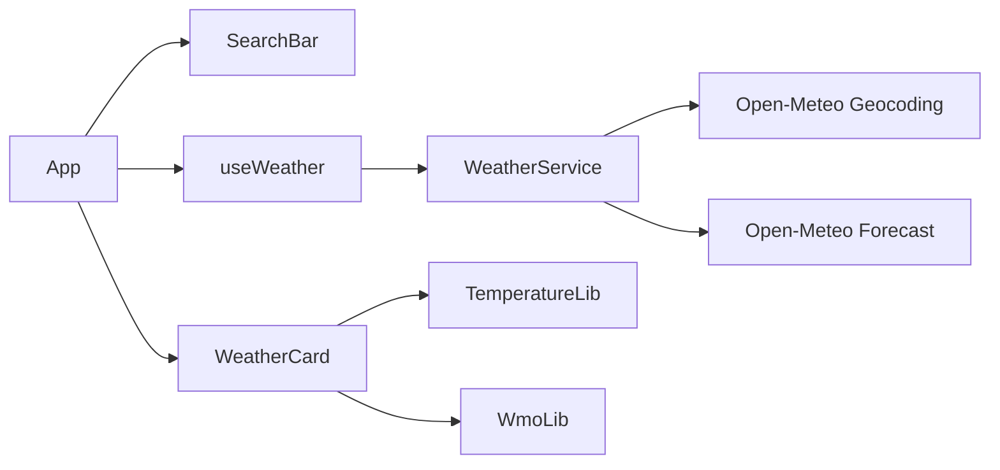

# Plano Técnico: Weather App

## Baseline

Este plano implementa a versão 1.1 da spec. Mudanças futuras devem atualizar
este documento por análise de impacto antes de alterar tasks ou código.

## Arquitetura

## Modelo de dados

- `Location`: identidade, nome, coordenadas, país e região opcional.
- `WeatherData.location`: localização selecionada.
- `WeatherData.current`: temperatura, sensação, código WMO, vento e umidade.
- `AsyncState<T>`: estados `idle`, `loading`, `success` e `error`.

O modelo da baseline não contém dados diários.

## Integrações

| Operação | Endpoint | Parâmetros relevantes |
|---|---|---|
| Buscar cidades | `geocoding-api.open-meteo.com/v1/search` | `name`, `count=5`, `language=pt`, `format=json` |
| Consultar clima | `api.open-meteo.com/v1/forecast` | `latitude`, `longitude`, `current`, `timezone=auto` |

## Decisões

| Decisão | Escolha | Motivo |
|---|---|---|
| Estado assíncrono | Hook local com union type | O fluxo é pequeno e não exige store global |
| Acesso externo | Serviço isolado | Mantém fetch e parâmetros fora da UI |
| Condições | Funções puras WMO | Facilita teste e fallback |
| E2E | Rotas interceptadas | Elimina dependência da rede real |

## Estratégia de testes

| Critérios | Nível | Evidência |
|---|---|---|
| CA1.1–CA1.4 | Serviço, hook, componente e E2E | `src/services/weather.test.ts`, `src/hooks/useWeather.test.ts`, `src/components/SearchBar.test.tsx`, `e2e/search.spec.ts` |
| CA2.1–CA2.6 | Serviço, hook, componente e E2E | `src/services/weather.test.ts`, `src/hooks/useWeather.test.ts`, `src/components/WeatherCard.test.tsx`, `e2e/search.spec.ts` |
| CA3.1–CA3.4 | Unitário | `src/lib/temperature.test.ts` |
| CA4.1–CA4.3 | Unitário e componente | `src/lib/wmo.test.ts`, `src/components/WeatherCard.test.tsx` |

## Regra de replanejamento

Validação vermelha produz feedback para o planning agent. O agente atualiza
primeiro este plano e coordena os deltas derivados antes de nova implementação.

## Delta F5: previsão diária de 7 dias

### Análise de impacto

| Superfície | Impacto mínimo |
|---|---|
| `WeatherData` | Acrescentar `daily` com arrays de data, máxima, mínima e código WMO |
| Open-Meteo Forecast | Solicitar `daily=temperature_2m_max,temperature_2m_min,weather_code`, `timezone=auto` e `forecast_days=7` |
| `WeatherCard` | Preservar a região de clima atual e acrescentar uma região acessível com sete entradas diárias |
| Testes | Usar fixtures com valores distintos e provar serviço, componente e jornada E2E |

Os arrays de `daily` são relacionados pelo mesmo índice: `time[i]`,
`temperature_2m_max[i]`, `temperature_2m_min[i]` e `weather_code[i]`
representam o mesmo dia.

### Decisões do delta

| Decisão | Escolha | Alternativa descartada | Motivo |
|---|---|---|---|
| Modelo Diário | Estender `WeatherData` com os arrays retornados pela API | Criar uma segunda árvore de estado | Mantém clima atual e previsão na mesma resposta |
| Período | `forecast_days=7` | Cortar um retorno maior na UI | O contrato é aplicado na fronteira externa |
| Campos | Solicitar apenas máxima, mínima e `weather_code` | Solicitar todos os campos diários | Evita dados sem requisito |
| Apresentação | Estender `WeatherCard` | Criar outro fluxo de seleção | Preserva a jornada existente |

### Estratégia de testes do delta

| Critério | Serviço | Componente | E2E |
|---|---|---|---|
| CA5.1 | Prova `forecast_days=7` e sete datas retornadas | Prova exatamente sete entradas | Prova sete entradas após busca e seleção |
| CA5.2 | Prova os arrays `temperature_2m_max` e `temperature_2m_min` | Prova máxima e mínima associadas a cada dia | Prova máxima e mínima na jornada |
| CA5.3 | Prova o array `weather_code` | Prova descrição e representação WMO por dia | Prova a condição na jornada |

A cobertura de F2 permanece nos testes existentes de serviço, componente e
E2E para detectar regressão do clima atual.

## Feedback da validação de T9

O teste focado `pnpm vitest run src/services/weather.test.ts` ficou vermelho:
4 testes passaram e 1 falhou. A falha ocorreu no teste de T9 ao usar o matcher
`toHaveSize` em um `Set`; o setup atual do Vitest/Chai reportou `Invalid Chai
property: toHaveSize`. Os asserts de unicidade dos sete dias não chegaram a
ser executados. O teste foi ajustado para comparar a propriedade `.size` dos
`Set`s, e a nova execução passou com 5 testes em 5. O serviço e o contrato
diário ficam validados no nível de serviço para T9.

## Iteração por feedback

### Comando e sintomas

`pnpm lint` passou, `pnpm build` passou, `pnpm test` passou com 23 testes e
`pnpm test:e2e` ficou vermelho com 3 de 5 cenários aprovados. O cenário F5
esperava `Nublado` para o código WMO 3, mas a implementação apresenta
`Encoberto`. O cenário CA2.5 não encontrou o card de clima atual após liberar a
resposta porque seu fixture específico contém `current`, mas não contém
`daily`.

### Hipótese

Os dois sintomas pertencem ao contrato dos fixtures E2E, não à Spec: a primeira
expectativa diverge do mapeamento WMO existente e a segunda resposta deixou de
ser compatível com `WeatherData` após a inclusão da previsão diária.

### Decisão mínima

Manter a Spec e os IDs existentes. Ajustar a expectativa do código 3 para
`Encoberto` e fazer o fixture de loading retornar a mesma estrutura `daily` de
sete entradas usada pelo forecast determinístico. Não alterar produção nem
criar novos critérios.

### Artefatos derivados

- `e2e/search.spec.ts`: corrigir a descrição esperada e completar o fixture do
    cenário CA2.5.
- `feedback/7-day-forecast-loop.md`: preservar os estados observados e a
    decisão desta iteração.
- `tasks/weather-app-tasks.md`: manter T11 pendente até a validação completa.

### Revalidação esperada

Executar novamente `pnpm test:e2e` e, após o E2E ficar verde, repetir `pnpm
lint`, `pnpm build`, `pnpm test`, `pnpm test:e2e`, `pnpm validate:sdd feedback` e
`pnpm validate:sdd full`. T11 só poderá ser concluída quando toda a cadeia
estiver verde.

### Feedback da validação da cadeia

`pnpm validate:sdd feedback` passou, mas `pnpm validate:sdd full` falhou porque
`e2e/search.spec.ts` não referencia explicitamente `CA5.1`, `CA5.2` e `CA5.3`.
Isso é uma lacuna de rastreabilidade no teste, não uma mudança de contrato.
Antes da implementação, o teste deve identificar o cenário com essas três
âncoras e manter, no mesmo cenário, as asserções de sete entradas, máxima e
mínima e condição WMO que elas representam.

### Resultado da revalidação

Após os ajustes derivados, `pnpm test:e2e` passou com 5 de 5 cenários. A
revalidação de `pnpm lint`, `pnpm build`, `pnpm test`, `pnpm validate:sdd
feedback` e `pnpm validate:sdd full` também passou. A Spec e os IDs foram
preservados, e T11 pode ser concluída.